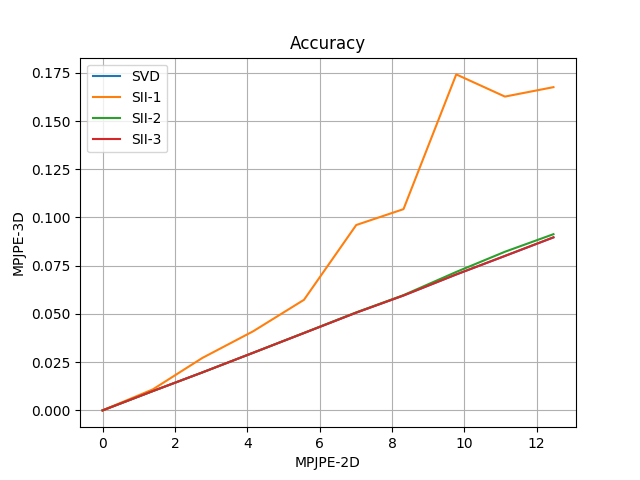
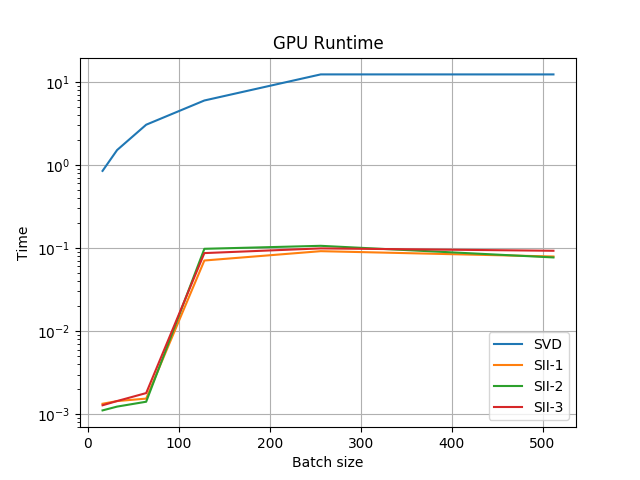

# Differentiable GPU-friendly Direct Linear Transform
This repository contains a PyTorch implementation of the GPU-friendly formulation of Direct Linear Transform proposed in the paper ["Lightweight Multi-View 3D Pose Estimation through Camera-Disentangled Representation"](https://arxiv.org/abs/2004.02186) (CVPR 2020).

The Direct Linear Transform (DLT) algorithm can be used to solve a set of similarity equations of the form

x<sub>k</sub> = &alpha; A y<sub>k</sub> for k in range(K),

where &alpha; is an uknown scalar mulitplier.

In our paper, we make use of DLT to lift a set of 2D detections, together with the associated projection matrices, to 3D in a differentiable fashion.
To do so efficiently, so that to use this operation to supervise training of our multi-view pose estimation pipeline, we propose a novel implementation of DLT based on **Shifted Inverse Iterations (SII)** which, on GPU architectures, is orders of magnitude faster than standard SVD-based ones. Refer to the manuscript for all details.

Here is a comparison of our method (DLT-SII) with respect to an SVD-based implementation of DLT (bechmarks run on an Nvidia Tesla V100 GPU):





# Getting started
To get started and install the minimal dependencies of this module simply run:
```
git clone https://github.com/edoRemelli/DiffDLT.git
cd DiffDLT
./setup.sh
```

Then, to make sure that everything is working, you can reproduce the benchmarks of the main paper by running 
```
python run_benchmark.py
```

# References
If you find our work useful for your research, don't forget to cite us 

```bibtex
@inproceedings{remelli2020lightweight,
  title={Lightweight Multi-View 3D Pose Estimation through Camera-Disentangled Representation},
  author={Remelli, Edoardo and Han, Shangchen and Honari, Sina and Fua, Pascal and Wang, Robert},
  booktitle={Proceedings of the IEEE/CVF Conference on Computer Vision and Pattern Recognition},
  pages={6040--6049},
  year={2020}
}
```
